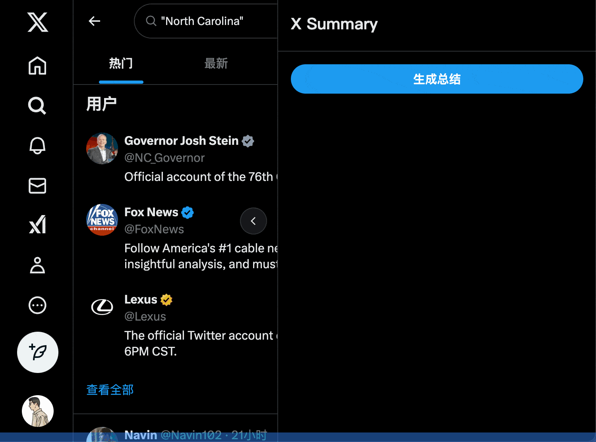

# 🚀 X Summary Chrome 扩展

> 📝 一键生成 X 推文和搜索结果的智能摘要助手，快速了解热点话题和重要信息，让阅读更高效！

## ✨ 主要特性

- 🎯 一键总结当前页面的内容
- ⚙️ 支持自定义 OpenAI 接口地址
- 🎨 简洁优雅的用户界面
- ⚡ 快速高效的内容处理

## 📦 安装指南

1. 🌐 打开 Chrome 浏览器
2. 🔧 进入扩展管理页面 (chrome://extensions/)
3. 👨‍💻 启用开发者模式
4. ➕ 点击"加载已解压的扩展程序"
5. 📁 选择本项目文件夹

## 🎮 使用方法

1. 🔍 点击浏览器工具栏中的扩展图标
2. 🔑 输入 OpenAI API Key（必填）
3. 🌍 输入自定义的 OpenAI 接口地址（可选）
4. 🖱️ 在 X 推文或搜索结果列表中点击"生成总结"按钮
5. ✨ 等待处理完成后查看摘要结果

## 📝 开源协议

[MIT](LICENSE) 